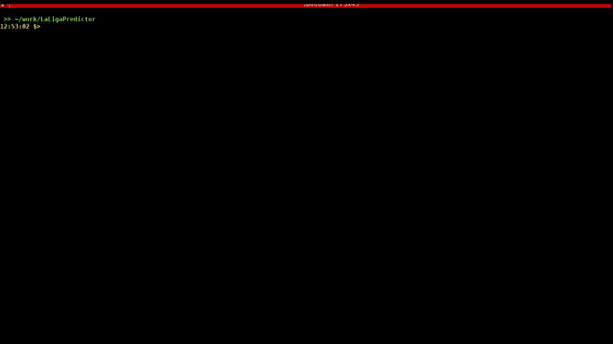

# LaLigaPredictor

**version v1.0.0-beta**

As of now, all data is in _data.csv_. Predict _N_ matches, and train with all previous entries in databse

Main program, _LaLigaPredictor.py_ processes, cleans data and use a MLP classifier to decide outcome of unknown matches. The classifier is run several times to try different initial random-states, so one ends up with a probability for each outcome (1, X, 2). If the probability of an outcome is larger than a threshold confidence value, the result is accepted.

The goal is to offer the user a way to systematically predict the outcome of future matches. In betting sites such as https://sports.bwin.com/en/sports/football-4, a user could, under their own responsibility, place bets following the predicted results. For last eight rounds in season 2019/20, we achieve a betting accuracy of 50.7 % (note that the results distribution for 2015-2020 is: 1:46.9%, X:25.3%, 2: 27.8%). An accuracy greater than 50 % means that one would always earn some amount of money for 1X2 betting ratios equal or greater than 1.



---

## Getting Started

### Prerequisites

The following packages are used:
- re
- numpy
- pandas
- statistics
- sklearn

### Usage

One can select which matches will be predicted by tuning the variables 'ignore_last_matches' and 'predict_matches'. The program will try to predict the outcome of the last 'predict_matches' entries in _data.csv_, after ignoring the last 'ignore_last_matches' entries. One would need to edit customizable parameters in header of _LaLigaPredictor.py_ and adapt the database _data.csv_, if necessary. Then, go to the main _LaLigaPredictor_ directory and simply tun _LaLigaPredictor.py_:

```
python LaLigaPredictor.py
```

---

## Database

### Basic database

I gathered data from different sources to get two initial databases:

**Laliga database**. It contains general information about previous matches. Originally from https://www.laliga.com/, although info has been compiled in Wikipedia already (e.g. https://es.wikipedia.org/wiki/Primera_Divisi%C3%B3n_de_Espa%C3%B1a_2018-19), from where I have extracted it. It includes: Season, Round, TeamHome, Result, TeamAway, Stadium, Date, Time, Referee (only for 2016-2020), Spectators (only for 2016-2020), YellowCards (only for 2016-2020), RedCards (only for 2016-2020).

**Sofifa database**. It contains information about previous matches (but not match time), and players for each match. This info is generated by a crawler that takes basic match information and players from: https://www.bdfutbol.com. I scrapped overall ratings and potentials of players from https://sofifa.com, which contains info about FIFA games. It includes: Season, Round, TeamHome, Result, TeamAway, Stadium, Date, Referee, PlayersRating, PlayersPotential.

Then, I combined these two databases:

**Basic database**. It contains information of all matches and players from 2015 to 2019: **Season, Round, Time, TeamHome, Result, TeamAway, Referee, PlayersHome, PlayersAway, RatingHome, RatingAway, PotentialHome, PotentialAway**

### Expanded database

We used the information in the basic database to create new descriptors that would help improve the MLP accuracy. The descriptors used so far include:
- Season								      _(season year)_
- Round 								      _(season round)_
- Time 								        _(time when match started)_
- Result 							        _(final result of match)_
- AverageRatingAway 				  _(average player rating of TeamAway)_
- AverageRatingDifference 		_(difference of average player rating between the two teams)_
- AveragePotentialAway 			  _(average player potential of TeamAway)_
- AveragePotentialDiff 			  _(difference of average player potential between the two teams)_
- TeamHomeRecentPointsHome 	  _(points obtained by TeamHome in last 5 matches played home)_
- TeamAwayRecentPointsAway 	  _(points obtained by TeamAway in last 5 matches played away)_
- TeamHomeRecentPoints 			  _(points obtained by TeamHome in last 5 matches)_
- TeamAwayRecentPoints 		  	_(points obtained by TeamAway in last 5 matches)_
- TeamHomeRecentTiedMatches 	_(number of matches tied in last 5 matches played by TeamHome)_
- TeamAwayRecentTiedMatches 	_(number of matches tied in last 5 matches played by TeamAway)_
- TeamHomeRecentGoalsScored 	_(number of goals scored by TeamHome in last 5 matches)_
- TeamAwayRecentGoalsScored 	_(number of goals scored by TeamAway in last 5 matches)_
- TeamHomeRecentPointsh2h 		_(number of points obtained by TeamHome in last two matches against TeamAway)_
- TeamAwayCurrentTotalPoints 	_(total points obtained at this points of the season by TeamAway)_
- CurrentTotalPointsDiff 		  _(difference of total points obtained at this points of the season by TeamHome and TeamAway)_

--- 

## Development

The program is still under development. Main features that will be added soon:
- Inclue older matches
- Include descriptors that help MLP accuracy
- Consider 1X2 betting ratios to advise user how risky bet would be: this will help increase long term gain

### Contribute

If you have any question or suggestion, feel free to contact me. If you want to contribute and directly make an improvement, feel free to fork the repository and push any changes.

--- 

## License and copyright

&copy; Marcos del Cueto Cordones

Licensed under the [MIT License](LICENSE.md).
